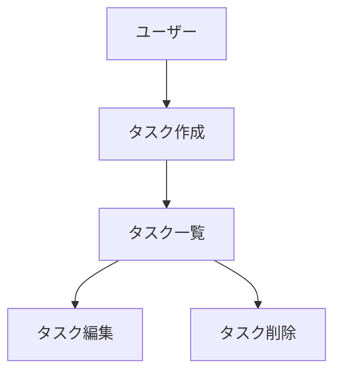

# AGENTS.md

## 概要

開発を進めるうえで遵守すべき標準ルールを定義します。

本ファイルは、当面リポジトリ全体の共通指示を 1 ファイルに統合して記載します（将来、必要に応じてサブディレクトリに `AGENTS.md` / `AGENTS.override.md` を追加する可能性はあります）。

## 言語

- 原則、日本語で記述する。
- ただし、以下は原文（英数字）を維持する:
  - コード、コマンド、ファイルパス、設定キー、拡張子、チェック名
  - GitHub 画面上のメニュー名や操作名
  - ツールのトリガー文言（例: `@codex review`、`$pr-flow`）
  - エラー文やログの引用

## Codex 指示の適用範囲と優先順位（重要）

- このファイルはリポジトリ全体の共通指示。
- 特定ディレクトリで追加ルールが必要な場合は、そのディレクトリ直下に `AGENTS.md` または `AGENTS.override.md` を置く。
- 同一ディレクトリでは `AGENTS.override.md` が `AGENTS.md` より優先される。
- 変更対象ファイルに近い階層の指示ほど優先する（root はフォールバック）。

## プロジェクト構造

本リポジトリは、タスク管理アプリケーション専用のリポジトリです。

### ドキュメントの分類

#### 1. 永続的ドキュメント（`docs/`）

アプリケーション全体の「何を作るか」「どう作るか」を定義する恒久的なドキュメント。
アプリケーションの基本設計や方針が変わらない限り更新されません。

- **product-requirements.md** - プロダクト要求定義書/何を作るか（価値・要件・受け入れ条件の一次ソース）
  - プロダクトビジョンと目的
  - ターゲットユーザーと課題・ニーズ
  - 主要な機能一覧
  - 成功の定義
  - ビジネス要件
  - ユーザーストーリー
  - 受け入れ条件
  - 機能要件
  - 非機能要件

- **functional-design.md** - 機能設計書/どう作るか（機能単位の設計・データモデル・画面/遷移・必要ならAPI）
  - 機能ごとのアーキテクチャ
  - システム構成図
  - データモデル定義（ER図含む）
  - コンポーネント設計
  - ユースケース図、画面遷移図、ワイヤフレーム
  - API設計（将来的にバックエンドと連携する場合）

- **architecture.md** - 技術仕様書/技術的な決定（スタック、制約、性能、運用上の非機能）
  - テクノロジースタック
  - 開発ツールと手法
  - 技術的制約と要件
  - パフォーマンス要件

- **repository-structure.md** - リポジトリ構造定義書/フォルダ・ファイル構成（事実の一覧）
  - フォルダ・ファイル構成
  - 生成/更新: `bash scripts/tree.sh`（手動編集しない）
  - 通常は `$precommit` 内で毎回更新する

- **development-guidelines.md** - 開発ガイドライン/規約と運用（命名、配置、テスト、Git、スタイル等のルール）
  - コーディング規約
  - 命名規則
  - ディレクトリの役割
  - ファイル配置ルール
  - スタイリング規約
  - テスト規約
  - Git規約

- **glossary.md** - ユビキタス言語定義/用語集（ドメイン用語と対応表。命名は“用語の表現”に限定）
  - ドメイン用語の定義
  - ビジネス用語の定義
  - UI/UX用語の定義
  - 英語・日本語対応表
  - コード上の命名規則

#### 2. 作業統括ドキュメント（`.steering/steering.md`）

`.steering/steering.md` は、複数ターミナルによる並列開発を前提にした「作業キュー/着手順/進捗の可視化」のための統括ドキュメントです。

目的:

- 作業単位（`.steering/<作業ID>-.../`）の一覧化と、進捗状況の更新による可視化
- 作業の着手順（直列/並列の関係、依存関係、着手条件）の明示

運用の原則（コンフリクト抑制）:

- 行の追加は原則末尾に追記する（並び替えをしない）。
- 着手順の表現は「ID 列」と「依存関係列」で行う（ファイル上の並び替えに依存しない）。
- 更新は原則として自分の作業行のみを変更する（頻繁な全体編集を避ける）。
- 詳細なタスク分解/進捗は各作業ディレクトリの `tasklist.md` を一次ソースとする。

推奨フォーマット（例）:

- 表形式で、以下を最低限持つ:
  - 作業ID
  - 作業ディレクトリ（リンク）
  - 状態（todo / doing / done など）
  - ブランチ名
  - 依存/着手条件（任意）
  - 備考（任意）

#### 3. 作業単位のドキュメント（`.steering/[作業ID]-[YYYYMMDD]-[開発タイトル]/`）

特定の開発作業における「今回何をするか」を定義する一時的なステアリングファイル。
作業完了後は参照用として保持されますが、新しい作業では新しいディレクトリを作成します。

- **requirements.md** - 今回の作業の要求内容
  - 変更・追加する機能の説明
  - ユーザーストーリー
  - 受け入れ条件
  - 制約事項

- **design.md** - 変更内容の設計
  - 実装アプローチ
  - 変更するコンポーネント
  - データ構造の変更
  - 影響範囲の分析

- **tasklist.md** - タスクリスト
  - 具体的な実装タスク
  - タスクの進捗状況
  - 完了条件

### ステアリング配下の構造

`.steering/` 配下は以下を基本構造とします。

- `.steering/steering.md`（作業統括ドキュメント）
- `.steering/[作業ID]-[YYYYMMDD]-[開発タイトル]/`（作業単位ディレクトリ）

### ステアリングディレクトリの命名規則

```bash
.steering/[作業ID]-[YYYYMMDD]-[開発タイトル]/
```

`[作業ID]` について:

- 形式: `N.M`
  - `N`: 直列の「大きな着手順」(1, 2, 3, ...)
  - `M`: 同一 `N` の中で並列に進められる作業の識別子 (0, 1, 2, 3, ...)

- 意味づけ:
  - 直列で進む単位作業は `1.0`, `2.0`, `3.0` のように付番する
  - 同一フェーズ内で並列に進めたい単位作業は `1.1`, `1.2`, `1.3` のように付番する（同じ `N` を共有する）

- 依存関係の一次ソースは `.steering/steering.md` に明示する（番号だけで全依存を表現しない）

注意（並び順）:

- OS やツールの表示順（文字列ソート）と、`N.M` の数値的な順序は一致しない場合がある。
- 表示順は `.steering/steering.md` を一次ソースとし、着手順はそこに明記する。
- 並び順の安定性を上げたい場合は、将来的に `01.00`, `01.01` のようなゼロ埋めを採用してもよい（採用する場合はプロジェクト内で統一する）。

例:

- 直列（単独）:
  - `.steering/1.0-20250103-initial-implementation/`
  - `.steering/2.0-20250115-add-tag-feature/`
  - `.steering/3.0-20250120-fix-filter-bug/`

- 並列（同一フェーズ内で分割）:
  - `.steering/1.1-20250103-add-task-create-ui/`
  - `.steering/1.2-20250103-add-task-list-ui/`
  - `.steering/1.3-20250103-add-task-edit-ui/`
  - `.steering/2.1-20250115-add-tag-schema/`
  - `.steering/2.2-20250115-add-tag-ui/`

## 開発プロセス

### 機能開発・修正時の手順

#### 0. ステアリング要否の確認（小規模作業向け）

- 作業開始前に、ステアリング（`.steering/` と requirements/design/tasklist）を作成するかを確認する。
- 「不要」と判断した場合:
  - 以降の作業ではステアリングを作成・更新しない（後追い作成もしない）。
  - この場合は **2, 4, 5, 7 を実施しない**。
  - PR 前の `document-update` でも `.steering/steering.md` を更新/作成しない。

#### 1. 影響分析

- 永続的ドキュメント（`docs/`）への影響を確認
- 変更が基本設計に影響する場合は `docs/` を更新

#### 2. 作業統括ドキュメント更新（`.steering/steering.md`）

- `.steering/steering.md` が無ければ作成する。
- 新しい作業を追加する際は、以下を最低限記載する:
  - 作業ID（直列/並列の意図が分かるように）
  - 作業ディレクトリ名（予定でもよい）
  - 状態（todo / doing / done）
  - ブランチ名（後述の規則に従う）
  - 依存関係/着手条件（必要な場合）

- 並列で進める作業は、衝突リスク（同一ファイル群の編集）と依存関係を明示する。
- ※ ステアリング不要と判断した場合は本ステップを実施しない。

#### 3. 作業ブランチ作成（単位作業と同期）

原則として「1 作業単位 = 1 ブランチ」で運用します。

- 作業着手（実装開始）前に、対象作業のブランチを作成して checkout する。
- ブランチ名は原則としてステアリングの `[開発タイトル]` と一致させる（kebab-case）。
  - 例: `add-tag-feature`

- 同名ブランチが既に存在する、または識別性を上げたい場合は `[作業ID]-[開発タイトル]` などの一意な命名にする。
  - 例: `1.2-add-tag-ui`

- ブランチ作成手順は `$branch-create`（git alias 優先）を参照する。フォールバックとして `git switch -c <branch>` でもよい。

注意:

- 1 ブランチで複数の作業ID（複数の `.steering/<作業ID>-.../`）を同時に進めない。
- 複数の作業を同時に進めたい場合は、作業を分割し、作業ID/作業ディレクトリ/ブランチを分ける。

#### 4. ステアリングディレクトリ作成

新しい作業用のディレクトリを作成します。

```bash
mkdir -p .steering/[作業ID]-[YYYYMMDD]-[開発タイトル]
```

例:

```bash
mkdir -p .steering/1.0-20250115-add-tag-feature
```

- ※ ステアリング不要と判断した場合は本ステップを実施しない。

#### 5. 作業ドキュメント作成

作業単位のドキュメントを作成します。
各ドキュメント作成後、必ず確認・承認を得てから次に進みます。

1. `.steering/[作業ID]-[YYYYMMDD]-[開発タイトル]/requirements.md` - 要求内容
2. `.steering/[作業ID]-[YYYYMMDD]-[開発タイトル]/design.md` - 設計
3. `.steering/[作業ID]-[YYYYMMDD]-[開発タイトル]/tasklist.md` - タスクリスト

重要: 1ファイルごとに作成後、必ず確認・承認を得てから次のファイル作成を行う

- ※ ステアリング不要と判断した場合は本ステップを実施しない。

#### 6. 永続的ドキュメント更新（必要な場合のみ）

変更が基本設計に影響する場合、該当する `docs/` 内のドキュメントを更新します。

#### 7. 実装開始

- `.steering/[作業ID]-[YYYYMMDD]-[開発タイトル]/tasklist.md` に基づいて実装を進めます。
- `.steering/steering.md` の状態を `doing` に更新します（必要な場合）。
- 作業中の進捗更新は以下を一次とする:
  - 詳細: `tasklist.md`
  - 俯瞰/状態: `steering.md`
- ※ ステアリング不要と判断した場合は本ステップを実施しない。

#### 8. 品質チェック

- 変更内容に応じて適切な検証を実施する（詳細は「完了条件」および skills を参照）。
- CI/required checks を壊さない（ローカルで通せない変更は不可）。

## ドキュメント管理の原則

### 永続的ドキュメント（`docs/`）

- アプリケーションの基本設計を記述
- 頻繁に更新されない
- 大きな設計変更時のみ更新
- プロジェクト全体の「北極星」として機能

### 作業統括ドキュメント（`.steering/steering.md`）

- 作業の俯瞰（着手順、並列/直列の関係、状態）を管理する
- 作業単位ディレクトリへの導線（リンク）を担う
- 並列開発時の衝突と依存関係の見える化に使う
- 詳細は各作業ディレクトリ配下のドキュメントを一次ソースとする

### 作業単位のドキュメント（`.steering/`）

- 特定の作業・変更に特化
- 作業ごとに新しいディレクトリを作成
- 作業完了後は履歴として保持
- 変更の意図と経緯を記録

## 図表・ダイアグラムの記載ルール

### 記載場所

設計図やダイアグラムは、関連する永続的ドキュメント内に直接記載します。
独立した diagrams フォルダは作成せず、手間を最小限に抑えます。

配置例:

- ER図、データモデル図 -> `functional-design.md` 内に記載
- ユースケース図 -> `functional-design.md` または `product-requirements.md` 内に記載
- 画面遷移図、ワイヤフレーム -> `functional-design.md` 内に記載
- システム構成図 -> `functional-design.md` または `architecture.md` 内に記載

### 記述形式

1. Mermaid記法（推奨）
   - Markdownに直接埋め込める
   - バージョン管理が容易
   - ツール不要で編集可能



2. ASCII アート
   - シンプルな図表に使用
   - テキストエディタで編集可能

```text
+-------------+
|   Header    |
+-------------+
      |
      v
+-------------+
|  Task List  |
+-------------+
```

3. 画像ファイル（必要な場合のみ）
   - 複雑なワイヤフレームやモックアップ
   - `docs/images/` フォルダに配置
   - PNG または SVG 形式を推奨

### 図表の更新

- 設計変更時は対応する図表も同時に更新
- 図表とコードの乖離を防ぐ

## 基本方針（常時適用・最重要）

### 秘密情報・安全

- PII/秘密情報をログ・例・コメント・テストデータ・PR本文に含めない。
  - トークン/API key/認証情報/内部URL などは出力しない。貼られている場合は伏せる。

- 「設定にAPI keyが含まれるもの（例: MCP）」は特に注意し、コピペで漏らさない。

### Git / GitHub 運用

- main/master への直接 push は禁止（PR 運用）。
- GitHub 上の操作（PR 作成/コメント/CI監視/ログ取得/マージ）は原則 `gh` を使う。
- ローカルのソース管理は `git` を使う（commit / push は `git`）。
- 認証は `gh auth status` を前提にし、`GH_TOKEN` の常用は避ける（CI/自動化用途の一時注入は可）。
- 原則として「1 作業単位（`.steering/<作業ID>-.../`）= 1 ブランチ = 1 PR」で運用する。

### 差分の品質

- 無関係な差分を避ける（タスクと関係ない整形・リファクタを混ぜない）。
- 差分は最小にする:
  - タスクに必要なファイルのみ編集する
  - 明示的な必要がない限り repo 全体の整形はしない

- `npm run fix` / `ruff check --fix` で大量差分が出た場合:
  - PR で理由を説明する、または
  - 整形のみの commit と機能変更 commit を分ける

- 新しい util/型/スキーマ/共通関数を追加する前に、まず既存実装を探索する（`$dedupe` を推奨）。

### 命名規則（検索性・重複抑止）

このリポジトリでは「追加前に横断検索する」運用を前提にする。
命名の一貫性を上げ、検索漏れによる重複実装を抑える。

全般:

- 既存がある場合は、既存の命名・語彙を最優先で踏襲する（新しい言い換えを作らない）。
- 同一概念は同一トークンで表現する（例: `User` と決めたら、同じ意味で `AccountUser` のような別名を増やさない）。
- 主要な export（関数/クラス/型/スキーマ/コンポーネント）の名前と、ファイル名（またはディレクトリ名）を対応させる。
- `utils2.ts` / `helpers_new.ts` のような “番号や曖昧語の増殖” を避ける。必要なら責務が分かる具体名にする（例: `date-format.ts`、`auth-token.ts`）。

TypeScript / Frontend:

- React コンポーネント:
  - コンポーネント名は `PascalCase`（例: `UserCard`）。
  - `components/` 配下のファイル名は原則 `kebab-case.tsx`（例: `user-card.tsx`）。
  - shadcn/ui 由来の `components/ui/*` は既存の命名を踏襲する。
  - Next.js 固有の `page.tsx` / `layout.tsx` / `loading.tsx` 等は例外（ルーティング規約を優先）。

- Hooks:
  - Hook 関数名は `useXxx`（例: `useUser`）。
  - 可能ならファイル名も `use-xxx.ts` など対応させる。

- ユーティリティ関数:
  - 役割を接頭辞で統一する（例: `getXxx` / `createXxx` / `parseXxx` / `formatXxx` / `toXxx` / `isXxx` / `assertXxx`）。
  - boolean は `isXxx` / `hasXxx` を優先し、`checkXxx` のような曖昧語は避ける。

- 型/スキーマ:
  - 型は `Xxx`、入力は `XxxInput`、出力は `XxxOutput`、API payload は `XxxRequest` / `XxxResponse` を優先する（既存があればそれに合わせる）。
  - Zod スキーマは `XxxSchema` の命名を優先し、`z.infer<typeof XxxSchema>` と対応させる。

Python / Backend:

- モジュール/関数/変数は `snake_case`、クラスは `PascalCase` を基本とする。
- pytest のテストは `test_*.py` とし、対象に対応する名称を含める（例: `test_health.py`）。

### UI 方針

- UI は shadcn/ui を優先する（独自UIの乱立を避ける）。
- 既存の shadcn/ui で足りない場合は、先に CLI で追加してから使う（例: `npx shadcn@latest add dialog`）。
- `lib/utils.ts` の `cn` を使って class 結合を統一する。
- UI変更があるPRでは、可能ならスクリーンショットを添付する。

## Review guidelines（Codex GitHub Code Review 用）

- PII/秘密情報をログ・例・コメント・テストデータに含めない。
- 意図しない public surface 変更を避ける（routes / env vars / exported APIs）。
- 無関係な差分を避ける（タスクと関係ない整形・リファクタを混ぜない）。
- CI を壊さない（`verify` を通せない変更は不可）。
- UI は shadcn/ui を優先する（独自UIの乱立を避ける）。
- テストを更新する:
  - Frontend: `__tests__/` の unit test（Jest + RTL）
  - Backend: `backend/tests/` の pytest
  - E2E: `e2e/` の Playwright（必須ではないが、重要導線は追加を検討）

- 重要度は P0/P1 を優先して指摘する（必要なら `@codex review for <focus>` で観点指定）。

## 事前確認が必要な変更（勝手に進めない）

- 以下に該当する場合は、実装前に確認を取る（理由・影響範囲・代替案も併記する）:
  - 本番依存の追加/削除（transitive deps を含む）
  - UIライブラリの追加（shadcn/ui 以外を足す、または設計が変わるもの）
  - 大規模リファクタ、repo 全体の整形、タスクと無関係な変更の混入
  - 認証/認可（authn/authz）、middleware、アクセス制御の変更
  - `.github/workflows/*`、CI の挙動、リポジトリ運用ルール（Ruleset など）に関する変更
  - 新しい環境変数の導入、既存環境変数の意味変更
  - 公開されている route / API / 外部参照されるコンポーネントの削除・リネーム
  - テスト基盤（Jest/Playwright/pytest/pyright 等）の差し替えや大幅変更
  - `.coderabbit.yaml` の大幅変更（レビュー品質/ノイズ量に直結）

## 標準コマンド（共通）

- commit 前の標準フロー（必須）:
  - `$precommit`
  - `export COMMIT_MSG='type(scope): 日本語要約'`
  - `$commit`（デフォルトで push まで行う。必要なら `PUSH=0`）

- PR を作成/更新する前の標準フロー（必須）:
  - `$document-update`（PR前のドキュメント整合。永続ファイルの不要な更新は禁止。必要最小限のみ）
  - `$precommit`
  - `export COMMIT_MSG='type(scope): 日本語要約'`
  - `$commit`
  - `$pr-flow`

- PR 作成〜CI待ち（入口）: `bash scripts/pr.sh`（無い場合は `gh` でフォールバック）
- リポジトリ構造ドキュメント更新: `bash scripts/tree.sh`（通常は `$precommit` 内で毎回実行）

## 完了条件（タスク / PR 共通）

- PR を提案する前、またはタスクを「完了」とする前に、必ずフル検証を通す:
  - 詳細手順は skill `$verify-full` を使う

- どれかが失敗した場合:
  - 問題を修正し、成功するまで再実行する

- PR を作成/更新する前に、`$document-update` によりドキュメント整合が取れていること（必要最小限の更新のみ）。
- Codex CLI はエディタ保存時整形を使わない前提のため、CLIチェックの通過を完了条件として重視する。

## commit メッセージ規約（日本語）

- コミットメッセージは日本語で書く（要約は日本語）。
- 形式:
  - `<type>(<scope>): <日本語の要約>`
  - scope が不要なら `<type>: <日本語の要約>`

- type/scope は英字固定。要約だけ日本語。
- 例:
  - `feat(backend): ヘルスチェックAPIを追加`
  - `fix(frontend): モバイルでボタンが切れる問題を修正`
  - `docs: ステアリング手順を更新`
  - `chore: 上記以外の修正`

## skills（手順の本体）

このリポジトリでは、長い手順・状況依存の手順は skills に分離する。

- PR前のドキュメント整合: `document-update`
- プレコミット（整形/セルフレビュー/tree 更新）: `precommit`
- コミット（verify-full 実行後に add/commit/push）: `commit`
- 重複検知/統合（既存探索の標準手順）: `dedupe`
- PR/CI の一連フロー（push後）: `pr-flow`
- 初期セットアップ（Frontend/Backend/ツール検知）: `repo-setup`
- Tailwind CSS v4 の導入: `setup-tailwind-frontend`
- skills 棚卸し提案の作成: `skills-retro`
- 速い検証（開発ループ）: `verify-fast`
- フル検証（PR前/完了前）: `verify-full`

### ブランチ運用

- ブランチ作成（自動命名・質問なし。steering優先）: `branch-create`

### MCP 連携（任意・環境依存）

- （MCP）ドキュメント参照: `mcp-context7-docs`
- （MCP）UI再現・スクショ・ログ収集: `mcp-playwright-debug`
- （MCP）安全なリファクタ（シンボル操作）: `mcp-serena-refactor`
- （MCP）パフォーマンス計測（DevTools）: `mcp-chrome-devtools-perf`

補足:

- skills の詳細は `.codex/skills/<skill-name>/SKILL.md` を参照する。

## ドキュメント整形

- `*.md` は Prettier の対象になり得る。
- `docs/repository-structure.md` は `bash scripts/tree.sh` により生成/更新する（手動編集しない）。
- commit 前の整形・整合チェックは `$precommit` を使う（内部で `npm run precommit` を実行する）。
- PR 前のドキュメント整合は `$document-update` を使う（永続ファイルの不要な更新は禁止。必要最小限のみ）。
- 整形差分が大量に出る場合は、理由を PR に明記するか、整形のみの commit と機能変更 commit を分ける。

## 注意事項

- ドキュメントの作成・更新は段階的に行い、各段階で承認を得る。
- `.steering/` のディレクトリ名は、`[作業ID]-[YYYYMMDD]-[開発タイトル]` で明確に識別できるようにする。
- `.steering/steering.md` は作業の俯瞰（着手順/状態/依存関係）を一次ソースとして扱う。
- 永続的ドキュメントと作業単位のドキュメントを混同しない。
