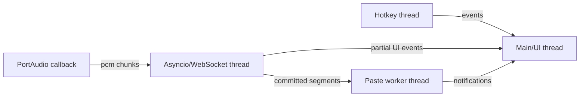

# 技術仕様書（architecture.md）

最終更新: 2026-04-29

## 1. 目的

この文書は voice-typer の技術スタック、アーキテクチャ、スレッドモデル、外部API連携、Windows固有制約、セキュリティ、性能、配布方針を定義する。

機能設計の詳細は `functional-design.md`、プロダクト上の要求は `product-requirements.md` を参照する。

## 2. 基本方針

- Windows 10 / 11 x64 専用のデスクトップ常駐アプリとして設計する。
- 初期実装では Python 3.12.x に固定する。
- GUIは軽量に保ち、常駐時のCPU、メモリ、ネットワーク使用量を抑える。
- 待機中はマイクを開かず、ネットワーク接続も持たない。
- 音声認識は ElevenLabs Scribe v2 Realtime API を使う。
- 自動貼付は best effort として設計し、失敗時もテキストを失わない。
- APIキーと発話本文の漏洩を防ぐ。
- 実装全体を、録音、API、貼付、UI、設定、Windows API ラッパーに分離する。

## 3. 技術スタック

### 3.1 言語とランタイム

| 項目       | 採用                | 備考                                                         |
| ---------- | ------------------- | ------------------------------------------------------------ |
| 言語       | Python 3.12.x       | 型ヒント、asyncio、Windows連携を重視。初期実装では固定する。 |
| ランタイム | CPython             | PyInstallerで配布可能。                                      |
| OS         | Windows 10 / 11 x64 | Win32 API、DPAPI、SendInput、RegisterHotKey を使う。         |

`.python-version`、CI matrix、PyInstaller build 環境、README の開発手順は Python 3.12.x に揃える。Python 3.11 は将来互換候補とし、Python 3.13 以上は依存ライブラリと PyInstaller の対応確認後に対象へ追加する。

### 3.2 主要ライブラリ

| ライブラリ        | 用途               | 備考                                                       |
| ----------------- | ------------------ | ---------------------------------------------------------- |
| `sounddevice`     | マイク録音         | PortAudioベース。callbackでPCM取得。                       |
| `websockets`      | Realtime WebSocket | asyncioベースの低レベル制御。                              |
| `pywin32`         | Win32 API          | クリップボード、SendInput、Mutex、DPAPI補助。              |
| `keyboard`        | PTT補助            | ToggleはRegisterHotKey優先。PTTで検証利用。                |
| `pystray`         | システムトレイ     | 常駐メニュー。                                             |
| `Pillow`          | アイコン画像       | トレイアイコン生成、読み込み。                             |
| `tkinter`         | オーバーレイ       | 標準ライブラリ。                                           |
| `soxr` または同等 | リサンプリング     | 16kHz非対応デバイスのfallback用。採用は実装時にPOCで確定。 |
| `platformdirs`    | 設定パス           | `%APPDATA%` 配下の扱いを明確化。任意。                     |

### 3.3 開発ツール

| ツール                  | 用途               |
| ----------------------- | ------------------ |
| `ruff`                  | lint、import順序。 |
| `black`                 | format。           |
| `mypy`                  | strict typing。    |
| `pytest`                | unit test。        |
| `pytest-cov`            | coverage。         |
| `pytest-mock`           | mock。             |
| `PyInstaller`           | exe化。            |
| `Inno Setup`            | インストーラ作成。 |
| `pip-tools` または `uv` | 依存ロック。       |

## 4. 外部APIアーキテクチャ

### 4.1 ElevenLabs Realtime API

接続方式:

- WebSocket endpoint: `wss://api.elevenlabs.io/v1/speech-to-text/realtime`
- 認証: `xi-api-key` header
- 接続設定: query parameter
- 音声送信: `input_audio_chunk` message
- 受信: `session_started`、`partial_transcript`、`committed_transcript`、`committed_transcript_with_timestamps`、error events

### 4.2 API層の分離

ElevenLabs API 仕様は変更され得るため、以下を分離する。

| 層                       | 役割                                                                |
| ------------------------ | ------------------------------------------------------------------- |
| `elevenlabs_protocol.py` | URL生成、query parameter、message encode/decode、event parse。      |
| `transcriber.py`         | 接続、送信、受信、再接続、状態通知。                                |
| `config.py`              | API関連設定の検証。                                                 |
| tests                    | manual smoke で得た actual schema を fixture 化した contract test。 |

実装コード内に query parameter 文字列を散在させない。

contract test は文書の写経ではなく、`scripts/manual_realtime_smoke.py` で得た actual schema を `tests/contract/fixtures/` に固定したものを一次ソースにする。manual commit、エラー payload 詳細、`session_started.config` の実フィールドは実API POCで確定してから `transcriber.py` 本実装へ進む。

### 4.3 APIパラメータの設計

初期値:

```json
{
  "model_id": "scribe_v2_realtime",
  "language_code": "jpn",
  "audio_format": "pcm_16000",
  "commit_strategy": "vad",
  "vad_silence_threshold_secs": 1.2,
  "vad_threshold": 0.4,
  "min_speech_duration_ms": 100,
  "min_silence_duration_ms": 100,
  "no_verbatim": true,
  "include_timestamps": false,
  "include_language_detection": false,
  "elevenlabs_enable_logging": true
}
```

設計上の注意:

- `vad_commit_strategy` は使わない。
- 初期化JSONは送らない。
- keyterms は必要時のみ送る。
- keyterms は追加料金の対象になり得るため、`enable_keyterms` で制御する。
- `elevenlabs_enable_logging=false` は Zero Retention Mode に関係するが、利用可否は契約プランに依存する。
- `audio_format=pcm_16000`、`commit_strategy=vad`、VAD関連パラメータ範囲、`keyterms` 最大50件かつ各20文字、`enable_logging` の意味は公式APIリファレンスを一次ソースとする。

### 4.4 commit方針

- 通常時は `commit_strategy=vad` による自動commitを使う。
- 停止時は `Flushing` 中に manual commit を補助的に使う。
- 長時間無停止で話し続けるユーザー向けに、将来 `max_segment_duration_sec` による補助commitを検討する。
- manual commit は短時間に多発させない。

## 5. Windowsアーキテクチャ

### 5.1 Win32 API ラッパー

Windows固有処理は `voice_typer/windows/` 配下に分離する。

| ファイル           | 役割                                                                             |
| ------------------ | -------------------------------------------------------------------------------- |
| `clipboard_win.py` | OpenClipboard、EmptyClipboard、SetClipboardData、GetClipboardSequenceNumber 等。 |
| `input_win.py`     | SendInput、キー状態確認。                                                        |
| `hotkey_win.py`    | RegisterHotKey、UnregisterHotKey、WM_HOTKEY loop。                               |
| `window_win.py`    | Foreground window、integrity level、monitor info。                               |
| `dpapi_win.py`     | CryptProtectData、CryptUnprotectData。                                           |
| `mutex_win.py`     | named mutex。                                                                    |
| `dpi_win.py`       | DPI awareness。                                                                  |

単一起動:

- 起動時に named mutex を取得する。
- 既に取得済みの場合、新プロセスは二重起動しない。
- 可能であれば既存プロセスへ通知し、既存トレイまたはオーバーレイを表示する。
- 通知に失敗した場合、新プロセスは短いメッセージを表示して終了する。
- 二重起動時に録音や貼付処理を開始しない。

### 5.2 SendInput制約

`SendInput` は UIPI の制約を受ける。アプリケーションは、自分と同等またはそれ以下の integrity level のプロセスへしか入力を注入できない。

設計上の扱い:

- 自動貼付は best effort とする。
- 管理者権限アプリへの貼付は保証しない。
- 貼付失敗時は committed text をクリップボードに残す。
- エラー表示で、管理者権限アプリや特殊入力欄の可能性を示す。

### 5.3 クリップボード制約

Win32 のクリップボードは複数フォーマットを保持できる。新しいデータを置く通常手順では、クリップボードを開き、空にし、提供する形式を設定する。そのため、テキストだけを置く実装では既存の画像、ファイル、HTML、RTF、アプリ独自形式が失われる可能性がある。

設計上の扱い:

- `auto_paste_restore_text` はテキスト形式のみ復元対象。
- 非テキスト形式の完全復元は保証しない。
- `clipboard_only` を安全モードとして提供する。
- `GetClipboardSequenceNumber` を使い、貼付処理中にユーザーがクリップボードを変更した場合は復元しない。
- 復元は、committed text 設定直後の sequence number と復元直前の sequence number が一致する場合のみ許可する。

### 5.4 Hotkey制約

- Toggleは `RegisterHotKey` を第一候補とする。
- PTTはキー押下とリリース検出が必要なため、低レベルキーフックまたは `keyboard` を使う。
- 無変換キーはIME操作と競合し得る。
- ホットキーはユーザー設定で変更可能にする。
- `VK_NONCONVERT` 単独登録、PTT用低レベルフックとの併用、二重発火、抑止可否はホットキー POC で実測してから本実装する。
- 併用で二重発火が解消できない場合は Toggle も低レベルフックへ統一する。

### 5.5 Overlay制約

- オーバーレイは `WS_EX_NOACTIVATE` を使い、フォーカスを奪わない。
- `WM_MOUSEACTIVATE` で `MA_NOACTIVATE` を返す。
- `WS_EX_TRANSPARENT` を常時使わない。ドラッグ操作を可能にするため。
- マルチモニタでは保存座標が画面外なら最も近いモニタへクランプする。

## 6. スレッドモデル

### 6.1 推奨構成



### 6.2 メインスレッド

- Tkinter UI。
- オーバーレイ更新。
- トレイイベント処理の集約。
- 状態遷移イベントの処理。

### 6.3 Audio callback thread

- PCM chunk を bounded queue へ投入する。
- それ以外の処理はしない。
- キュー投入失敗時は軽量なoverflow flagを立てる。

### 6.4 Asyncio/WebSocket thread

- WebSocket接続。
- 音声チャンクのbase64 encode。
- 音声送信。
- 受信イベント処理。
- 再接続。
- protocol error handling。

### 6.5 Paste worker thread

- 貼付キューを直列処理する。
- クリップボード操作を直列化する。
- Ctrl+V を送信する。
- 貼付失敗時に通知する。

### 6.6 スレッド間通信

- 標準の `queue.Queue` または `asyncio.Queue` を用途に応じて使う。
- スレッド境界を越えるデータは dataclass で型付けする。
- UI更新は必ずメインスレッドへ marshal する。
- 本文をログへ出さないため、デバッグ用 `repr` に注意する。

## 7. 音声処理アーキテクチャ

### 7.1 録音開始

- ホットキー押下後に録音を開始する。
- 待機中はマイクを開かない。
- 16kHzで開ける場合はそのまま送信形式として使う。
- 16kHzで開けない場合は既定サンプルレートで開き、16kHzへ変換する。

### 7.2 接続中バッファ

真のプリロールはMVPで採用しない。採用するのは、ホットキー押下後の接続中バッファである。

- `Connecting` 中の音声をキューに蓄積する。
- `session_started` 後に古い順に送る。
- 上限超過時は初期設定で停止する。

### 7.3 再接続バッファ

- `Reconnecting` 中は最大 `reconnect_buffer_sec` だけ音声を保持する。
- 既定値は3秒。
- 超過時は停止する。
- 再接続後の最初のチャンクに `previous_text` を付与する。

### 7.4 ローカルVAD

- 各チャンクのRMSを計算する。
- 音声活動がない時間を測る。
- `speech_started` イベントには依存しない。
- サーバVADはcommit用、ローカルVADは自動停止用として責務を分ける。

## 8. セキュリティアーキテクチャ

### 8.1 APIキー保護

- APIキー本体はDPAPIで暗号化する。
- 暗号化データは `%APPDATA%/voice-typer/secrets.dat` などに保存する。
- `config.json` には `has_api_key` と `api_key_storage` のみ置く。
- APIキーはプロセスメモリ上に必要期間だけ保持する。
- ログ出力時はAPIキーをマスクする。

### 8.2 ログ保護

禁止:

- 音声データ。
- partial text。
- committed text。
- クリップボード本文。
- keyterms 内容。
- APIキー。

許可:

- keyterms 件数。
- state transition。
- error type。
- duration。
- queue depth。
- window handle の有無。ただしタイトルに機密情報が含まれる可能性があるため、ウィンドウタイトルは原則ログに出さない。

### 8.3 クラウド送信の明示

READMEと設定例に以下を明記する。

- 音声はElevenLabs APIに送信される。
- ローカルログには発話内容を保存しない。
- ElevenLabs側のデータ保持は同社ポリシーと契約プランに依存する。
- Zero Retention Mode は利用可能なプランでのみ有効化できる。

### 8.4 クリップボード履歴

- 認識結果は貼付のためにクリップボードへ入る。
- Windowsのクリップボード履歴やクラウド同期に残る可能性がある。
- 機密入力向けには将来 `sensitive_mode` を追加する。

## 9. エラー処理アーキテクチャ

### 9.1 エラー分類

| 分類          | 例                                   | 処理                           |
| ------------- | ------------------------------------ | ------------------------------ |
| 設定エラー    | APIキー未設定、keyterms不正          | 起動継続、録音不可、設定促進。 |
| 認証エラー    | `auth_error`                         | リトライしない。               |
| 利用枠エラー  | `quota_exceeded`                     | リトライしない。               |
| レート制限    | `rate_limited`                       | バックオフ。                   |
| API入力エラー | `input_error`, `chunk_size_exceeded` | セッション停止。               |
| STT処理エラー | `transcriber_error`                  | 既定停止。既知の一時的障害のみ回数上限付きバックオフ。 |
| 汎用APIエラー | `error`                              | 既定停止。既知の recoverable subtype のみ個別方針。 |
| 接続エラー    | WebSocket切断                        | 短期再接続。                   |
| 音声エラー    | マイク失敗、queue overflow           | 停止、通知。                   |
| 貼付エラー    | SendInput失敗、clipboard lock        | クリップボード保持、通知。     |
| UIエラー      | overlay作成失敗                      | トレイ継続、ログ。             |

### 9.2 バックオフ

- 初期 500ms。
- 最大 10s。
- jitter を入れる。
- `auth_error`、`quota_exceeded`、`unaccepted_terms` では使わない。
- 最大リトライ回数超過で `Error` へ移行する。

### 9.3 セッション終了時の安全性

- 例外発生時も録音ストリームを閉じる。
- ホットキーを解除する。
- WebSocketを閉じる。
- クリップボード操作中に例外が起きても CloseClipboard を保証する。
- アプリ終了時は `Flushing` を可能な範囲で実行する。

## 10. パフォーマンス設計

### 10.1 目標

| 指標                              | 目標                 |
| --------------------------------- | -------------------- |
| hotkey -> recorder started        | p95 200ms以内        |
| hotkey -> websocket connected     | p95 1500ms以内       |
| first audio sent -> first partial | p95 1000ms以内       |
| committed -> paste completed      | p95 300ms以内        |
| flush duration                    | p95 3000ms以内       |
| waiting CPU                       | 低負荷。実測で調整。 |
| waiting network                   | 0                    |
| waiting microphone                | 0                    |

### 10.2 計測

- 時刻は monotonic clock を使う。
- 本文を含めずに duration のみ記録する。
- セッション単位で summary metric を出す。

### 10.3 最適化方針

優先順位:

1. 録音開始を速くする。
2. 接続中バッファで頭欠けを減らす。
3. UIスレッドをブロックしない。
4. 貼付キューを直列化し、クリップボード競合を避ける。
5. WebSocketを不要に長く開かない。

## 11. 設定アーキテクチャ

### 11.1 ファイル配置

| ファイル | 場所                                |
| -------- | ----------------------------------- |
| config   | `%APPDATA%/voice-typer/config.json` |
| secrets  | `%APPDATA%/voice-typer/secrets.dat` |
| logs     | `%APPDATA%/voice-typer/logs/`       |
| cache    | `%LOCALAPPDATA%/voice-typer/`       |

### 11.2 config version

- `config_version` を必須にする。
- バージョン差異がある場合は migration を行う。
- migration 前に `.bak` を作る。
- migration に失敗したら初期設定を生成し、ユーザーに通知する。

### 11.3 設定検証

起動時に以下を検証する。

| 設定                          |        型 |  最小 |   最大 | 既定 | 不正時        |
| ----------------------------- | --------: | ----: | -----: | ---: | ------------- |
| `vad_silence_threshold_secs`  |     float |   0.3 |    3.0 |  1.2 | `ConfigError` |
| `vad_threshold`               |     float |   0.1 |    0.9 |  0.4 | `ConfigError` |
| `min_speech_duration_ms`      |       int |    50 |   2000 |  100 | `ConfigError` |
| `min_silence_duration_ms`     |       int |    50 |   2000 |  100 | `ConfigError` |
| `audio_chunk_ms`              |       int |    20 |    500 |  100 | `ConfigError` |
| `local_vad_threshold`         |       int |     0 |  32767 |  500 | `ConfigError` |
| `local_vad_min_active_chunks` |       int |     1 |     10 |    2 | `ConfigError` |
| `silence_timeout_sec`         |       int |     5 |    600 |  180 | `ConfigError` |
| `paste_delay_ms`              |       int |    50 |   2000 |  200 | `ConfigError` |
| `paste_timeout_ms`            |       int |   300 |  10000 | 1500 | `ConfigError` |
| `audio_queue_max_chunks`      |       int |     1 |    300 |   50 | `ConfigError` |
| `reconnect_buffer_sec`        |       int |     0 |     10 |    3 | `ConfigError` |
| `keyterms`                    | list[str] |   0件 |   50件 | `[]` | `ConfigError` |
| `keyterms[]`                  |       str | 1文字 | 20文字 | なし | `ConfigError` |

上記に加えて、`commit_strategy`、`paste_mode`、`target_window_policy`、`on_audio_queue_overflow` が許可値か、`hotkey` 文字列が解釈可能かを検証する。

cross-field invariant:

- MVP の `commit_strategy` は `vad` のみ許可する。`manual` は将来候補であり、MVPでは `ConfigError` とする。
- `paste_delay_ms < paste_timeout_ms` を満たす。
- `silence_timeout_sec > vad_silence_threshold_secs` を満たす。

### 11.4 ログローテーション

- ログ保存先は `%APPDATA%/voice-typer/logs/` とする。
- `max_bytes = 5MB` とする。
- `backup_count = 5` とする。
- 本文、音声、APIキー、keyterms、クリップボード本文、対象ウィンドウタイトルは出力しない。

### 11.5 APIキー設定

- MVPのAPIキー設定主経路は `scripts/set_api_key.py` とする。
- トレイの Set API key は、このCLIまたは最小入力ダイアログを起動するだけにする。
- APIキーは `config.json` に保存しない。
- `secure_store.py` が DPAPI で `secrets.dat` に保存する。
- `config.json` には `has_api_key` と `api_key_storage` のみ保存する。

## 12. 配布アーキテクチャ

### 12.1 開発時実行

```bash
python -m voice_typer
```

### 12.2 exe化

- PyInstaller を使う。
- `--windowed` を使い、コンソールを出さない。
- ログはファイルへ出力する。
- アイコンは `assets/icon.ico` を使う。

### 12.3 インストーラ

- Inno Setup を使う。
- インストール先は `%LOCALAPPDATA%/Programs/voice-typer` または `Program Files` を検討する。
- スタートアップ登録はユーザー選択にする。
- アンインストール時に設定ファイルを削除するか残すか選べるようにする。

### 12.4 署名

- 個人利用MVPではコード署名なしでも可。
- 配布範囲を広げる場合はコード署名を検討する。
- UIAccess を使う設計はMVPでは採用しない。署名、インストール先、権限要件が増えるため。

## 13. CIアーキテクチャ

### 13.1 必須ジョブ

| ジョブ        | runner                        | 内容                                                 |
| ------------- | ----------------------------- | ---------------------------------------------------- |
| lint          | ubuntu-latest                 | ruff, black check。                                  |
| typecheck     | ubuntu-latest                 | mypy。                                               |
| unit          | ubuntu-latest, windows-latest | pytest。Windows API mock含む。                       |
| api-contract  | ubuntu-latest, windows-latest | URL生成、イベントparse。                             |
| windows-smoke | windows-latest                | import smoke、clipboard mock、hotkey wrapper smoke。 |

### 13.2 任意ジョブ

- coverage。
- dependency audit。
- release packaging。

### 13.3 分割workflow

| workflow            | runner                        | 実行タイミング                   | 内容                                                                 |
| ------------------- | ----------------------------- | -------------------------------- | -------------------------------------------------------------------- |
| `ci.yml`            | ubuntu-latest, windows-latest | pull request                     | ubuntuでlint/typecheck、両OSでunit/contract、Windowsでimport smoke。 |
| `windows-smoke.yml` | windows-latest                | manual または main push          | clipboard wrapper、hotkey wrapper、DPAPI smoke。                     |
| `build-smoke.yml`   | windows-latest                | nightly または workflow_dispatch | PyInstaller build smoke。                                            |
| `release.yml`       | windows-latest                | tag push                         | PyInstaller、Inno Setup、artifact/release。                          |

毎PRで PyInstaller build smoke は実行しない。必要な場合は `workflow_dispatch` または nightly で確認する。

## 14. テストアーキテクチャ

### 14.1 テスト種別

| 種別          | 目的                                                 |
| ------------- | ---------------------------------------------------- |
| unit          | pure Python logic。                                  |
| contract      | ElevenLabs URL、message、event仕様。                 |
| integration   | recorder、transcriber、paster の境界。mock中心。     |
| windows smoke | Windows API wrapper が最低限import、初期化できるか。 |
| manual E2E    | 実アプリでNotepad、Word、Chrome等へ貼付。            |

### 14.2 実APIテスト

実APIテストは通常CIで実行しない。

理由:

- APIキーが必要。
- 課金が発生する。
- ネットワーク依存で不安定。
- 音声入力が必要。

ローカル開発者向けに `tests/manual/` または `scripts/manual_realtime_smoke.py` を用意する。

### 14.3 手動E2E対象

- Notepad。
- Word。
- Chrome input / textarea。
- Google Docs。
- Slack。
- Teams。
- VSCode。
- Notion。
- 管理者権限のNotepad。失敗する可能性の確認用。
- パスワード欄。貼付制限の確認用。

## 15. リスク管理

| リスク             | 技術的対策                                       |
| ------------------ | ------------------------------------------------ |
| API仕様変更        | API層分離、contract test、公式ドキュメント確認。 |
| 音声頭欠け         | ホットキー直後録音、接続中バッファ。             |
| 待機中マイク不安   | 待機中はマイクを開かない。                       |
| 貼付失敗           | クリップボード保持、通知。                       |
| クリップボード破壊 | モード分離、sequence確認、復元範囲明記。         |
| final欠落          | `Flushing` 状態。                                |
| queue overflow     | bounded queue、overflow policy。                 |
| UIフリーズ         | UIスレッドと処理スレッド分離。                   |
| APIキー漏洩        | DPAPI、ログマスク。                              |
| 本文漏洩           | ログ禁止、repr注意。                             |

## 16. 外部仕様参照

実装時に確認する一次情報。

- ElevenLabs Realtime Speech-to-Text API Reference
  - `https://elevenlabs.io/docs/api-reference/speech-to-text/v-1-speech-to-text-realtime`
- ElevenLabs Realtime event reference
  - `https://elevenlabs.io/docs/eleven-api/guides/how-to/speech-to-text/realtime/event-reference`
- ElevenLabs Realtime transcripts and commit strategies
  - `https://elevenlabs.io/docs/eleven-api/guides/how-to/speech-to-text/realtime/transcripts-and-commit-strategies`
- Microsoft Learn SendInput
  - `https://learn.microsoft.com/en-us/windows/win32/api/winuser/nf-winuser-sendinput`
- Microsoft Learn RegisterHotKey
  - `https://learn.microsoft.com/en-us/windows/win32/api/winuser/nf-winuser-registerhotkey`
- Microsoft Learn Using the Clipboard
  - `https://learn.microsoft.com/en-us/windows/win32/dataxchg/using-the-clipboard`
