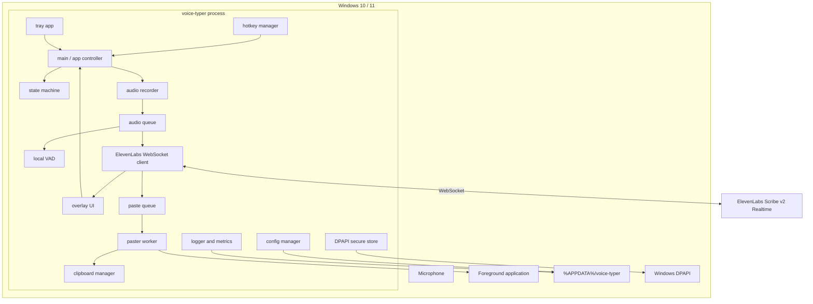
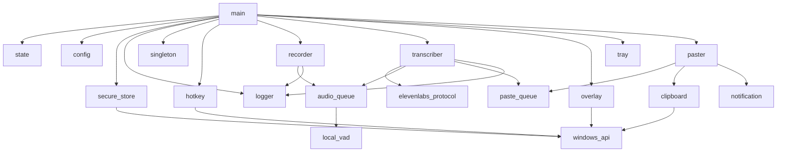
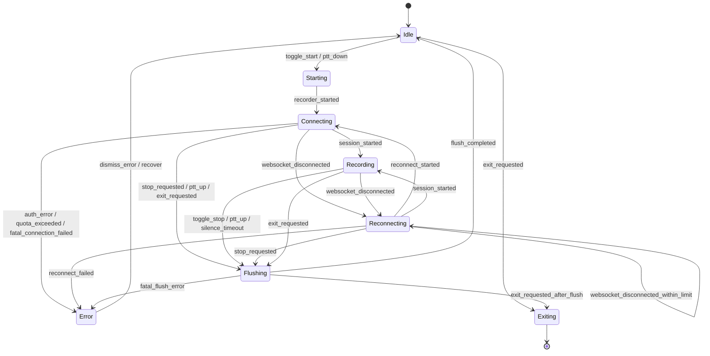
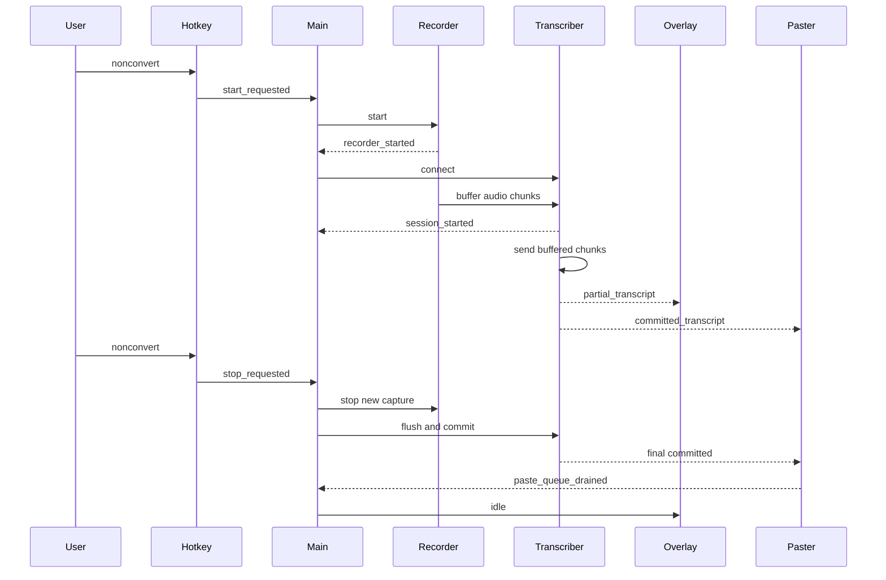
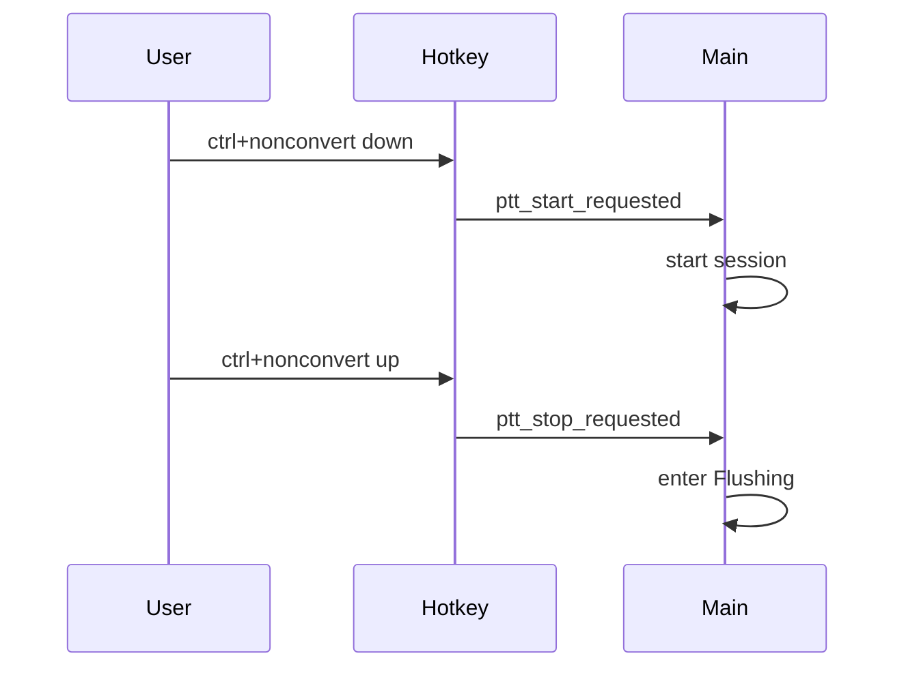
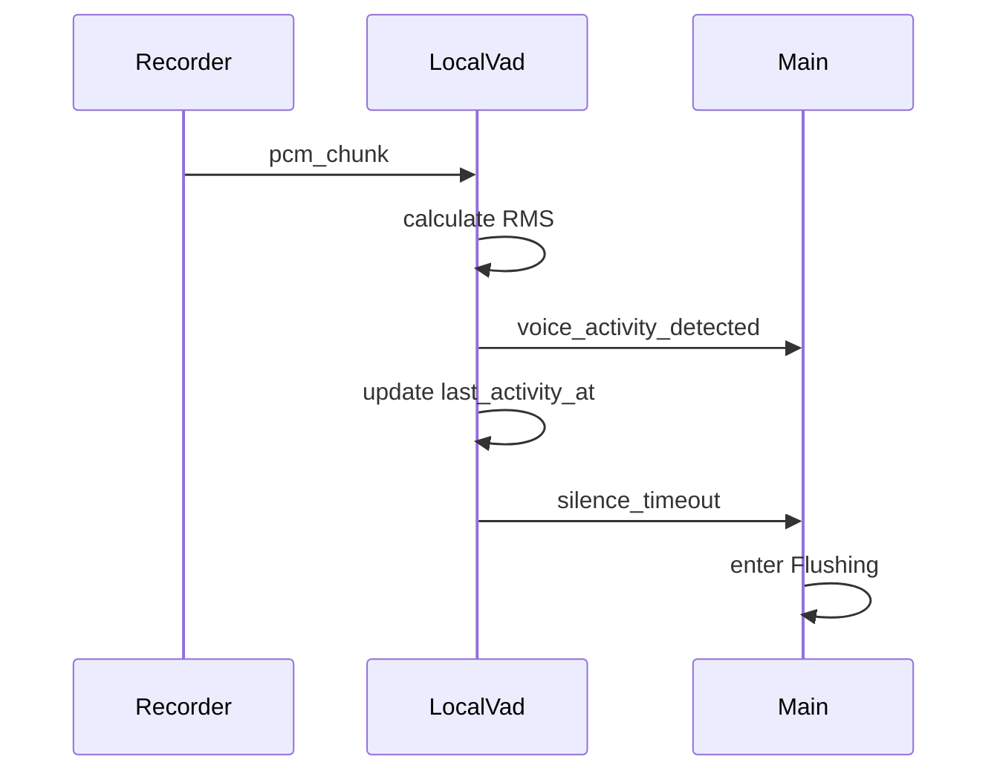
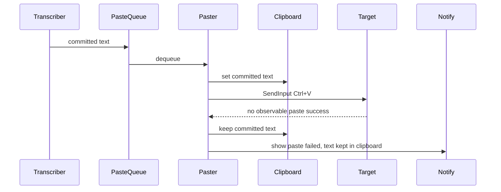

# 機能設計書（functional-design.md）

最終更新: 2026-04-29

## 1. 目的

この文書は、voice-typer の機能単位の設計、状態遷移、モジュール責務、データモデル、外部API連携、Windows固有処理を定義する。

実装時はこの文書を機能設計の一次ソースとする。

## 2. 全体像

### 2.1 システム構成



### 2.2 基本フロー

1. アプリ起動時に設定を読み込み、APIキー有無を確認する。
2. グローバルホットキーとトレイを初期化する。
3. ユーザーがホットキーを押す。
4. 録音を即時開始し、音声チャンクをローカルキューへ入れる。
5. ElevenLabs Realtime WebSocket へ接続する。
6. `session_started` 受信後、接続中バッファの音声を送信する。
7. 録音中の音声チャンクを送信し続ける。
8. `partial_transcript` はオーバーレイへ表示する。
9. `committed_transcript` は貼付キューへ投入する。
10. 貼付ワーカーが設定された `paste_mode` に従って貼付またはクリップボード保存する。
11. 停止操作、PTTリリース、無音タイムアウト、エラーにより `Flushing` へ移行する。
12. 未送信音声、manual commit、最終 committed、貼付キューを処理してから `Idle` へ戻る。

## 3. モジュール設計

### 3.1 モジュール一覧

| モジュール       | 想定ファイル                         | 主責務                                                |
| ---------------- | ------------------------------------ | ----------------------------------------------------- |
| エントリポイント | `voice_typer/__main__.py`            | `python -m voice_typer` 起動。                        |
| アプリ制御       | `voice_typer/main.py`                | 初期化、終了、モジュール統合。                        |
| 状態管理         | `voice_typer/state.py`               | アプリ状態のステートマシン。                          |
| 設定管理         | `voice_typer/config.py`              | `config.json` 読込、保存、検証、マイグレーション。    |
| Secret管理       | `voice_typer/secure_store.py`        | DPAPI によるAPIキー保存と取得。                       |
| ログ             | `voice_typer/logger.py`              | ログ、メトリクス、マスク処理。                        |
| 多重起動防止     | `voice_typer/singleton.py`           | Windows Mutex。                                       |
| ホットキー       | `voice_typer/hotkey.py`              | RegisterHotKey、PTT hook、二重発火抑止。              |
| 録音             | `voice_typer/recorder.py`            | sounddevice stream、サンプルレートfallback。          |
| 音声キュー       | `voice_typer/audio_queue.py`         | PCMチャンクのキュー、接続中バッファ、再接続バッファ。 |
| ローカルVAD      | `voice_typer/local_vad.py`           | RMS計算、音声活動判定、無音タイマー。                 |
| Realtime API     | `voice_typer/transcriber.py`         | WebSocket接続、音声送信、イベント受信、再接続。       |
| APIメッセージ    | `voice_typer/elevenlabs_protocol.py` | URL生成、query parameter、イベントパース。            |
| オーバーレイ     | `voice_typer/overlay.py`             | 状態表示、partial表示、非アクティブウィンドウ。       |
| トレイ           | `voice_typer/tray.py`                | システムトレイ、メニュー、状態表示。                  |
| 貼付キュー       | `voice_typer/paste_queue.py`         | committed セグメントの順序管理。                      |
| 貼付             | `voice_typer/paster.py`              | 貼付モード、SendInput、失敗通知。                     |
| クリップボード   | `voice_typer/clipboard.py`           | テキスト退避、設定、復元、sequence確認。              |
| Windows API      | `voice_typer/windows/*.py`           | Win32 API ラッパー。                                  |
| 通知             | `voice_typer/notification.py`        | オーバーレイまたはトレイ通知。                        |

単一起動:

- 起動時に named mutex を取得する。
- 既に取得済みの場合、新プロセスは二重起動しない。
- 可能であれば既存プロセスへ通知し、既存トレイまたはオーバーレイを表示する。
- 通知に失敗した場合、新プロセスは短いメッセージを表示して終了する。
- 二重起動時に録音や貼付処理を開始しない。

### 3.2 依存関係



### 3.3 スレッドとイベントループ

| 処理                        | 実行場所                         | 注意点                                      |
| --------------------------- | -------------------------------- | ------------------------------------------- |
| Tkinter overlay             | メインスレッド                   | UI更新はメインスレッドに集約する。          |
| pystray                     | メインスレッドまたは専用スレッド | 実装都合により選択。UI更新キューを使う。    |
| RegisterHotKey message loop | 専用スレッドまたはメインスレッド | `WM_HOTKEY` を受ける。                      |
| PTT低レベルキーフック       | 専用スレッド                     | Toggleと二重発火しないよう制御する。        |
| sounddevice callback        | PortAudio callback thread        | PCM bytes をqueueへ入れるだけにする。       |
| WebSocket                   | asyncio event loop thread        | 接続、送信、受信、再接続を集約する。        |
| Paster                      | 専用ワーカースレッド             | クリップボード操作とSendInputを直列化する。 |
| ログ                        | 各スレッド                       | 本文とsecretを出さない。                    |

## 4. 状態管理

### 4.1 状態一覧

| 状態           | 意味                                                      |
| -------------- | --------------------------------------------------------- |
| `Idle`         | 待機中。マイクもWebSocketも開かない。                     |
| `Starting`     | ホットキー押下後。録音開始と接続開始を進める。            |
| `Connecting`   | WebSocket接続中。録音チャンクは接続中バッファに保持する。 |
| `Recording`    | 録音中。音声送信、partial表示、committed貼付を行う。      |
| `Reconnecting` | WebSocket切断後の再接続中。短時間だけ音声を保持する。     |
| `Flushing`     | 停止処理中。未送信音声、commit、final、貼付を処理する。   |
| `Error`        | ユーザー対応が必要なエラー状態。                          |
| `Exiting`      | アプリ終了処理中。                                        |

### 4.2 状態遷移



### 4.3 状態別処理

#### Idle

- マイクを開かない。
- WebSocket接続を持たない。
- ホットキーとトレイは有効。
- オーバーレイは待機表示。

#### Starting

- APIキー有無を確認する。
- 録音ストリームを開始する。
- 音声チャンクを接続中バッファへ蓄積する。
- WebSocket接続処理を開始する。
- オーバーレイを録音準備中にする。

#### Connecting

- WebSocket handshake を待つ。
- `session_started` 受信までは音声を送信しない。
- バッファ上限超過時は設定に従って停止または破棄する。
- `session_started` 受信前に WebSocket が切断された場合は `Reconnecting` へ移行する。
- `session_started` 受信前にユーザー停止、PTTリリース、終了要求を受けた場合は `Flushing` へ移行する。

#### Recording

- 音声チャンクを送信する。
- ローカルVADで無音タイマーを管理する。
- partialをオーバーレイに表示する。
- committedを貼付キューに投入する。

#### Reconnecting

- 録音は継続してよいが、最大 `reconnect_buffer_sec` だけ保持する。
- 上限超過時は停止する。
- 再接続後の最初のチャンクへ `previous_text` を付与する。
- オーバーレイに再接続中を表示する。
- ローカルVADの activity 計測は継続してよい。
- `silence_timeout_sec` による自動停止は一時停止する。
- `reconnect_buffer_sec` を `Reconnecting` のハード上限とする。
- `reconnect_buffer_sec` を超えた場合は再接続失敗として停止し、未認識音声が失われ得ることを通知する。
- 再接続試行中に再び切断された場合も、`reconnect_buffer_sec` の範囲内では `Reconnecting` を継続する。
- `reconnect_buffer_sec` 超過時は `reconnect_failed` として `Error` へ移行する。

#### Flushing

- 新規録音を停止する。
- 未送信チャンクを送信する。
- manual commit を送る。
- `final_commit_wait_ms` まで committed を待つ。
- 貼付キューを drain する。
- WebSocket を閉じる。
- recorder を解放する。
- オーバーレイを Idle 表示へ戻す。
- `final_commit_wait_ms` を過ぎた後に到着した `committed_transcript` は破棄する。
- 遅延破棄時は本文をログに出さず、`late_committed_discarded` として件数のみ記録する。
- `Flushing` 中のホットキー入力は無視し、必要に応じて「確定処理中です」と通知する。
- `Flushing` 中に WebSocket が切断された場合、再接続は試みず、受信済み committed の貼付キュー drain 後に `Idle` へ戻る。
- `Flushing` 中にアプリ終了要求が来た場合、短い grace period の後に安全終了する。

#### Error

- エラー種別を表示する。
- リトライ可能な場合のみ自動回復する。
- `auth_error`、`quota_exceeded`、`unaccepted_terms` はユーザー対応待ちにする。

## 5. ユースケース設計

### 5.1 Toggle録音



### 5.2 Push-to-Talk



PTT中は、Toggleホットキーの単体イベントを抑止する。

PTT 押下中は `silence_timeout_sec` を無効化する。停止条件は PTT リリース、明示停止、重大エラーのいずれかとする。MVP はローカル最大録音時間を持たず、API側の `session_time_limit_exceeded` を受けた場合に停止する。Toggle録音中は `silence_timeout_sec` をローカルVADで有効にする。

### 5.3 自動停止



サーバイベントに `speech_started` が存在する前提を置かない。

### 5.4 貼付失敗



## 6. ElevenLabs Realtime API 設計

### 6.1 接続

WebSocket endpoint:

```text
wss://api.elevenlabs.io/v1/speech-to-text/realtime
```

認証:

```text
Header: xi-api-key: <decrypted API key>
```

クライアントサイドの一時トークン方式はMVPでは採用しない。Windowsデスクトップアプリとして、ユーザー自身のAPIキーをDPAPIで保護して使用する。

### 6.2 query parameter

MVPの標準パラメータ:

| パラメータ                   | 値                   | 備考                                        |
| ---------------------------- | -------------------- | ------------------------------------------- |
| `model_id`                   | `scribe_v2_realtime` | 固定。                                      |
| `language_code`              | `jpn`                | 日本語専用。                                |
| `audio_format`               | `pcm_16000`          | 16kHz PCM。                                 |
| `commit_strategy`            | `vad`                | VAD自動コミット。                           |
| `vad_silence_threshold_secs` | `1.2`                | 初期値。設定可能。                          |
| `vad_threshold`              | `0.4`                | 初期値。設定可能。                          |
| `min_speech_duration_ms`     | `100`                | 初期値。                                    |
| `min_silence_duration_ms`    | `100`                | 初期値。                                    |
| `no_verbatim`                | `true`               | フィラー除去。                              |
| `include_timestamps`         | `false`              | MVPでは不要。                               |
| `include_language_detection` | `false`              | 日本語固定のため不要。                      |
| `enable_logging`             | `true`               | ElevenLabs側のログ設定。ZRT可否は契約依存。 |
| `keyterms`                   | optional             | `enable_keyterms=true` の場合のみ。         |

禁止:

- `vad_commit_strategy`
- 接続後の独自セッション初期化JSON
- `speech_started` を前提にしたイベント処理

MVPでは `commit_strategy=vad` を強制する。設定ファイルで `manual` が指定された場合は `ConfigError` とする。manual commit は `Flushing` 時の補助要求としてのみ使い、常時 manual commit 運用は将来候補とする。

### 6.3 接続URL生成例

```text
wss://api.elevenlabs.io/v1/speech-to-text/realtime?model_id=scribe_v2_realtime&language_code=jpn&audio_format=pcm_16000&commit_strategy=vad&vad_silence_threshold_secs=1.2&vad_threshold=0.4&min_speech_duration_ms=100&min_silence_duration_ms=100&no_verbatim=true&include_timestamps=false&include_language_detection=false&enable_logging=true
```

`keyterms` は複数値またはAPI仕様に従った形式でURL encodeする。生成方法は contract test で固定する。

### 6.3.1 実API contract 確定手順

ElevenLabs Realtime API の接続URL、query parameter、既知イベント名は公式ドキュメントを一次ソースとする。

一方、以下は `scripts/manual_realtime_smoke.py` による実API POCで確定し、得られた actual schema を `tests/contract/fixtures/` に固定する。

- raw WebSocket での manual commit の送信形態。
- `commit=true` を音声チャンクと同時に送る場合の挙動。
- 空チャンクまたは commit-only message が許容されるか。
- エラーイベントの実フィールド名。
- `session_started.config` の実レスポンス構造。
- unknown field 受信時の扱い。

`transcriber.py` の本実装は、この contract fixture を一次ソースとして実装する。文書を写しただけの contract test を一次ソースにしてはいけない。

### 6.4 送信メッセージ

基本の音声チャンク:

```json
{
  "message_type": "input_audio_chunk",
  "audio_base_64": "<base64 encoded PCM>",
  "sample_rate": 16000,
  "commit": false
}
```

停止時の最終チャンクまたはcommit指示:

```json
{
  "message_type": "input_audio_chunk",
  "audio_base_64": "<base64 encoded PCM>",
  "sample_rate": 16000,
  "commit": true
}
```

再接続直後の最初のチャンクでは、必要に応じて `previous_text` を付ける。

```json
{
  "message_type": "input_audio_chunk",
  "audio_base_64": "<base64 encoded PCM>",
  "sample_rate": 16000,
  "commit": false,
  "previous_text": "直近確定テキストの末尾"
}
```

制約:

- `previous_text` は再接続後の最初の音声チャンクにのみ付与する。
- `previous_text` は50文字未満を目安にする。公式ガイド由来の制約として扱い、実API POCで送信時の実挙動も確認する。
- manual commit を短時間に多発させない。
- 1チャンクは100msを基本とし、APIの上限を超えない。

### 6.5 受信イベント

#### `session_started`

用途:

- 接続確立確認。
- 接続中バッファ送信開始のトリガー。
- UIを `Recording` 表示へ移行。

#### `partial_transcript`

用途:

- オーバーレイ表示。
- ローカル活動シグナルの補助。

禁止:

- 対象アプリへの貼付。
- 確定テキストとしての保存。

#### `committed_transcript`

用途:

- 貼付キュー投入。
- `last_committed_text` 更新。
- 再接続時の `previous_text` 生成に利用。

#### `committed_transcript_with_timestamps`

MVPでは `include_timestamps=false` のため通常受信しない。受信した場合は `text` を committed と同様に処理する。

#### エラーイベント

| エラー                        | 処理                                                      |
| ----------------------------- | --------------------------------------------------------- |
| `auth_error`                  | リトライしない。APIキー設定を促す。                       |
| `quota_exceeded`              | リトライしない。利用枠確認を促す。                        |
| `unaccepted_terms`            | リトライしない。ElevenLabs側で規約承諾を促す。            |
| `rate_limited`                | 短期バックオフ。連続時は停止。                            |
| `resource_exhausted`          | バックオフ後に再接続を試す。                              |
| `queue_overflow`              | 送信過多として停止し、チャンク設定を見直す通知。          |
| `chunk_size_exceeded`         | チャンクサイズ異常として停止。                            |
| `input_error`                 | 音声形式またはパラメータ異常として停止。                  |
| `insufficient_audio_activity` | 無音扱いで停止またはIdleへ戻す。                          |
| `commit_throttled`            | manual commit頻度を下げ、現在セッションは継続または停止。 |
| `session_time_limit_exceeded` | セッション終了。必要なら新規セッション開始を案内。        |
| `transcriber_error`           | 本文を含まない詳細をログに残してエラー表示。既定では停止し、既知の一時的障害に分類できる場合のみ回数上限付きでバックオフ再接続。 |
| `error`                       | generic error。本文を含まない payload 詳細をログに残し、既定では停止。既知の recoverable subtype に対応付けられる場合のみ、その subtype の方針に従う。 |

## 7. 音声設計

### 7.1 録音形式

| 項目               | 値            |
| ------------------ | ------------- |
| channel            | mono          |
| sample width       | int16         |
| endian             | little-endian |
| target sample rate | 16000 Hz      |
| chunk duration     | 100 ms        |
| samples per chunk  | 1600          |
| bytes per chunk    | 3200          |

### 7.2 初期化手順

1. デフォルト入力デバイスを取得する。
2. 16kHz / mono / int16 で `InputStream` を開く。
3. 失敗した場合、デバイス既定サンプルレートで開く。
4. 既定サンプルレートから16kHzへリサンプリングする。
5. それも失敗した場合、`MicrophoneUnavailableError` を発生させる。

MVPではセッション開始時点の既定入力デバイスを使い、セッション中の既定デバイス変更には追従しない。セッション中にデバイスハンドルが無効化された場合は `MicrophoneUnavailableError` として停止し、可能な範囲で `Flushing` を実行する。次回録音開始時に、その時点の既定入力デバイスを再取得する。デバイス選択UIは将来候補とする。

### 7.3 コールバック制約

録音コールバック内で行うこと:

- PCM bytes への軽量変換。
- bounded queue への投入。
- 投入できない場合の軽量フラグ設定。

録音コールバック内で行わないこと:

- base64 encode。
- WebSocket送信。
- ファイルI/O。
- ログの大量出力。
- UI更新。
- 重いRMS計算。
- リサンプリングの重い処理。

### 7.4 キュー

`audio_queue_max_chunks` の初期値は50とする。100msチャンクの場合、約5秒分である。

`on_audio_queue_overflow`:

| 値            | 動作                               |
| ------------- | ---------------------------------- |
| `stop`        | セッションを停止する。初期値。     |
| `drop_oldest` | 古いチャンクを破棄する。実験設定。 |
| `drop_newest` | 新しいチャンクを破棄する。非推奨。 |

## 8. ローカルVAD設計

### 8.1 目的

ローカルVADは、サーバ側 commit ではなく、停止忘れ防止とコスト保護のために使う。

### 8.2 入力

- 16kHz、int16、mono PCM chunk。
- 基本チャンク長は100ms。

### 8.3 RMS計算

擬似コード:

```python
def calculate_rms(samples: Sequence[int]) -> float:
    if not samples:
        return 0.0
    return sqrt(sum(sample * sample for sample in samples) / len(samples))
```

### 8.4 判定

- `rms >= local_vad_threshold` のチャンクが `local_vad_min_active_chunks` 回連続した場合のみ音声活動あり。
- 単発ノイズで silence timer がリセットされることを避ける。
- 音声活動ありの場合、`last_voice_activity_at` を更新する。
- `now - last_voice_activity_at >= silence_timeout_sec` なら自動停止する。

### 8.5 初期値

| 設定                               | 初期値   |
| ---------------------------------- | -------- |
| `local_vad_threshold`              | 500      |
| `silence_timeout_sec`              | 180      |
| `local_vad_min_active_chunks`      | 2        |
| `local_vad_noise_floor_adaptation` | 将来候補 |

## 9. クリップボードと貼付設計

### 9.1 貼付モード

| `paste_mode`              | 説明                                                  | MVP      |
| ------------------------- | ----------------------------------------------------- | -------- |
| `auto_paste_restore_text` | テキスト退避、committed設定、Ctrl+V、テキスト復元     | 対応     |
| `auto_paste_no_restore`   | committed設定、Ctrl+V、認識結果をクリップボードに残す | 対応     |
| `clipboard_only`          | committedをクリップボードへ保存するだけ               | 対応     |
| `direct_unicode_input`    | SendInput Unicodeで直接入力を試す                     | 将来候補 |

### 9.2 `auto_paste_restore_text` の処理

1. 貼付開始時の clipboard sequence number を取得する。
2. `CF_UNICODETEXT` がある場合のみテキストを退避する。
3. 非テキスト形式の存在を検出し、必要に応じてログに形式種別のみ残す。
4. committed text を `CF_UNICODETEXT` としてクリップボードへ設定する。
5. 設定直後の clipboard sequence number を取得する。
6. foreground window を確認する。
7. `SendInput` で Ctrl+V を送る。
8. `paste_delay_ms` 待機する。
9. 復元前の clipboard sequence number を再確認する。
10. 復元前 sequence が設定直後 sequence と一致する場合のみ、元テキスト復元を許可する。
11. 復元前 sequence が設定直後 sequence と異なる場合、ユーザーまたは他アプリがクリップボードを変更した可能性があるため復元しない。
12. 退避したテキストがあり、復元可能な場合のみ復元する。

擬似コード:

```python
seq_before = get_clipboard_sequence_number()
backup_text = read_cf_unicodetext_if_exists()
set_cf_unicodetext(committed_text)
seq_after_set = get_clipboard_sequence_number()
send_ctrl_v()
sleep(paste_delay_ms)
seq_before_restore = get_clipboard_sequence_number()

if seq_before_restore == seq_after_set and backup_text is not None:
    restore_cf_unicodetext(backup_text)
else:
    keep_committed_text_or_current_clipboard()
```

制約:

- 非テキスト形式は完全復元しない。
- 画像、ファイル、HTML、RTF、アプリ独自形式は失われる可能性がある。
- 本文はログへ出さない。

### 9.3 `auto_paste_no_restore` の処理

1. committed text をクリップボードへ設定する。
2. Ctrl+V を送る。
3. 認識結果をクリップボードに残す。

用途:

- 貼付失敗時も結果を確実に残したい場合。
- ユーザーが直後に再貼付する可能性が高い場合。

### 9.4 `clipboard_only` の処理

1. committed text をセッション内の確定テキストへ追記する。
2. セッション終了または committed 単位でクリップボードへ保存する。
3. Ctrl+V は送らない。

設定候補:

| 設定                    | 値                             |
| ----------------------- | ------------------------------ |
| `clipboard_only_update` | `per_commit` または `on_flush` |
| 初期値                  | `per_commit`                   |

### 9.5 SendInput

送信キー:

- Ctrl down
- V down
- V up
- Ctrl up

注意:

- 押下中の既存キー状態を確認する。
- UIPIにより失敗する場合がある。
- 戻り値だけでUIPI起因を特定できない場合がある。
- 失敗時はクリップボードに結果を残す。

### 9.6 貼付対象ポリシー

| `target_window_policy`    | 動作                                                      |
| ------------------------- | --------------------------------------------------------- |
| `foreground_at_commit`    | committed受信時のforeground windowへ貼付する。初期値。    |
| `foreground_at_paste`     | 貼付実行時のforeground windowへ貼付する。                 |
| `locked_at_session_start` | セッション開始時のforeground windowへ貼付する。将来候補。 |

MVP初期値は `foreground_at_commit` とする。committed受信から貼付までの間にユーザーが別アプリへ移動した場合、誤貼付を減らすためである。

貼付対象決定:

- `Recording` 開始時に foreground window を `last_known_target_hwnd` として保存する。
- committed 受信時に foreground window を取得する。
- foreground window が自プロセスの overlay、tray、config window の場合、`last_known_target_hwnd` へフォールバックする。
- target hwnd が存在しない、無効、最小化、入力不可、または権限制約で `SendInput` できない場合、貼付失敗として扱う。
- 貼付失敗時は committed text をクリップボードへ残し、通知する。

### 9.7 貼付時間設定

`paste_delay_ms` は、`SendInput` で Ctrl+V を送った後、復元判定を始めるまで待つ時間である。

`paste_timeout_ms` は、paste worker が1件の paste task を開始してから、クリップボード設定、Ctrl+V、復元または復元抑止、通知までを完了する最大時間である。

`clipboard_open_timeout_ms` は、クリップボードを開く retry の最大時間である。必要なら別設定として追加する。

### 9.8 重複セグメント判定

- 直前1件の committed segment とのみ比較する。
- 比較前に前後空白を除去し、連続空白を単一空白へ正規化する。
- 完全一致した場合のみ重複として破棄する。
- セッション全体との比較、部分一致、類似度判定は行わない。
- 日本語文字の NFKC 正規化は MVP では行わない。

## 10. ホットキー設計

### 10.1 Toggle

- Win32 `RegisterHotKey` を第一候補とする。
- `MOD_NOREPEAT` を利用可能な環境では使う。
- `WM_HOTKEY` 受信時に状態に応じて start / stop を発火する。

### 10.2 Push-to-Talk

- 押下とリリースを検出するため、低レベルキーフックまたは `keyboard` ライブラリを使う。
- 押下中フラグを持つ。
- リリース時に stop を発火する。
- PTTが有効な間はToggleの同時発火を抑止する。

### 10.3 設定

```json
{
  "hotkey_toggle": "nonconvert",
  "hotkey_ptt": "ctrl+nonconvert",
  "hotkey_suppress_original_key": false
}
```

### 10.4 エラー

- ホットキー登録失敗時は `HotkeyRegistrationError` とする。
- アプリは起動を継続し、トレイから設定変更できるようにする。
- エラー通知に、競合している可能性があることを示す。

### 10.5 POC ゲートと fallback

ホットキー実装は本実装前に POC で確定する。

検証項目:

1. `VK_NONCONVERT` 単独を `RegisterHotKey` で登録できるか。
2. `Ctrl+VK_NONCONVERT` を PTT として扱えるか。
3. Toggle と PTT 併用時に二重発火しないか。
4. `hotkey_suppress_original_key=true` の場合に Toggle 側も抑止できるか。
5. IME の無変換動作と競合しないか。
6. `hotkey_suppress_original_key=true` 時に IME の無変換キー機能、IME ON/OFF などを意図せず奪わないか。

fallback:

- `RegisterHotKey` と低レベルフックの併用で二重発火が解消できない場合、Toggle も低レベルフックへ統一する。
- 無変換キーが登録不可または競合する場合、既定ホットキーを別候補へ変更できるようにする。

## 11. オーバーレイ設計

### 11.1 要件

- フォーカスを奪わない。
- 録音状態を明確に表示する。
- partial を表示する。
- ドラッグ移動できる。
- 位置を保存する。
- マルチモニタで画面外に出た場合は最も近いモニタへクランプする。

### 11.2 Windows属性

- `WS_EX_NOACTIVATE` を使う。
- `WM_MOUSEACTIVATE` で `MA_NOACTIVATE` を返す。
- 必要に応じて topmost を設定する。
- `WS_EX_TRANSPARENT` は常時適用しない。ドラッグ可能領域でマウスイベントを受けるため。

### 11.3 表示状態

| アプリ状態     | 表示                  |
| -------------- | --------------------- |
| `Idle`         | 小さい待機表示。      |
| `Starting`     | 準備中表示。          |
| `Connecting`   | 接続中表示。          |
| `Recording`    | 録音中表示とpartial。 |
| `Reconnecting` | 再接続中表示。        |
| `Flushing`     | 確定中表示。          |
| `Error`        | エラー要約。          |

`Error` 状態では Error overlay をクリックすると dismiss し、`Idle` へ戻る。本文やAPIキーは overlay に表示しない。

### 11.4 partial表示

- partial は最新値のみ表示する。
- 長文の場合は末尾を優先表示する。
- 本文をログへ出さない。
- UI更新はメインスレッドで行う。

## 12. トレイ設計

### 12.1 メニュー

| メニュー      | 動作                                             |
| ------------- | ------------------------------------------------ |
| Start         | Idle時に録音開始。                               |
| Stop          | Recording / Connecting / Reconnecting 時に停止。 |
| Open config   | 設定ファイルを既定エディタで開く。               |
| Open logs     | ログディレクトリを開く。                         |
| Set API key   | APIキー入力ダイアログまたはCLIを開く。           |
| Dismiss error | Error状態を確認済みにしてIdleへ戻す。            |
| Mode          | paste mode を切り替える。将来候補。              |
| Exit          | 安全停止後に終了。                               |

### 12.2 状態表示

- Idle
- Recording
- Connecting
- Reconnecting
- Flushing
- Error

アイコン画像は `assets/` に置く。文字アイコンや絵文字で状態を表さない。

MVPのAPIキー設定:

- 主経路は `scripts/set_api_key.py` とする。
- トレイの Set API key は、このCLIまたは最小入力ダイアログを起動するだけにする。
- APIキーは `config.json` に保存しない。
- `secure_store.py` が DPAPI で `secrets.dat` に保存する。
- `config.json` には `has_api_key` と `api_key_storage` のみ保存する。

## 13. 設定データモデル

### 13.1 `AppConfig`

```python
@dataclass(frozen=True)
class AppConfig:
    config_version: int
    api_key_storage: Literal["dpapi"]
    has_api_key: bool
    model_id: str
    language_code: str
    audio_format: str
    commit_strategy: Literal["vad"]
    vad_silence_threshold_secs: float
    vad_threshold: float
    min_speech_duration_ms: int
    min_silence_duration_ms: int
    no_verbatim: bool
    include_timestamps: bool
    include_language_detection: bool
    elevenlabs_enable_logging: bool
    enable_keyterms: bool
    keyterms: list[str]
    hotkey_toggle: str
    hotkey_ptt: str
    hotkey_suppress_original_key: bool
    paste_mode: PasteMode
    paste_delay_ms: int
    paste_timeout_ms: int
    target_window_policy: TargetWindowPolicy
    audio_chunk_ms: int
    audio_queue_max_chunks: int
    on_audio_queue_overflow: AudioQueueOverflowPolicy
    local_vad_threshold: int
    silence_timeout_sec: int
    reconnect_buffer_sec: int
    final_commit_wait_ms: int
    overlay_enabled: bool
    overlay_position: OverlayPosition | None
    startup_enabled: bool
    local_log_level: str
```

### 13.2 `OverlayPosition`

```python
@dataclass(frozen=True)
class OverlayPosition:
    monitor_id: str | None
    x: int
    y: int
```

`monitor_id` が存在しない、または対象モニタが見つからない場合、現在利用可能な最も近いモニタへクランプする。

### 13.3 `PasteMode`

```python
PasteMode = Literal[
    "auto_paste_restore_text",
    "auto_paste_no_restore",
    "clipboard_only",
    "direct_unicode_input",
]
```

`direct_unicode_input` は設定値として予約できるが、MVPで未実装の場合は起動時にエラーまたはfallbackする。

### 13.4 `TranscriptSegment`

```python
@dataclass(frozen=True)
class TranscriptSegment:
    segment_id: str
    text: str
    received_at: datetime
    source_event: Literal["committed_transcript", "committed_transcript_with_timestamps"]
    sequence_no: int
```

本文はログ出力禁止。`repr=False` を検討する。

### 13.5 `AudioChunk`

```python
@dataclass(frozen=True)
class AudioChunk:
    pcm: bytes
    sample_rate: int
    duration_ms: int
    captured_at: datetime
    sequence_no: int
    rms: float | None = None
```

### 13.6 `StateTransition`

```python
@dataclass(frozen=True)
class StateTransition:
    from_state: AppState
    to_state: AppState
    reason: str
    occurred_at: datetime
```

## 14. エラー設計

### 14.1 カスタム例外

| 例外                         | 意味                     |
| ---------------------------- | ------------------------ |
| `ConfigError`                | 設定不正。               |
| `SecretStoreError`           | DPAPI保存、取得失敗。    |
| `ApiKeyMissingError`         | APIキー未設定。          |
| `HotkeyRegistrationError`    | ホットキー登録失敗。     |
| `MicrophoneUnavailableError` | マイク初期化失敗。       |
| `AudioQueueOverflowError`    | 音声キュー上限超過。     |
| `TranscriberConnectionError` | WebSocket接続失敗。      |
| `TranscriberProtocolError`   | APIメッセージ不正。      |
| `PasteError`                 | 貼付失敗。               |
| `ClipboardError`             | クリップボード操作失敗。 |

### 14.2 ユーザー通知文言

| 状況          | 文言                                                           |
| ------------- | -------------------------------------------------------------- |
| APIキー未設定 | APIキーが設定されていません。設定してください。                |
| 認証失敗      | ElevenLabs APIキーを確認してください。                         |
| クォータ不足  | ElevenLabs の利用枠を確認してください。                        |
| 貼付失敗      | 貼付できませんでした。認識結果はクリップボードに保存しました。 |
| マイク失敗    | マイクを開始できませんでした。入力デバイスを確認してください。 |
| 再接続中      | 接続が切れました。再接続しています。                           |
| 自動停止      | 無音が続いたため停止しました。                                 |

本文やAPIキーを通知文に含めない。

## 15. ログとメトリクス設計

### 15.1 ログに出す情報

- 状態遷移。
- エラー種別。
- 接続開始、接続成功、接続失敗。
- 録音開始、停止。
- キュー長。
- 貼付成功、失敗。
- duration。
- 設定値の一部。ただしsecretと本文は除外。

### 15.2 ログに出さない情報

- 音声バイト列。
- partial text。
- committed text。
- クリップボード本文。
- APIキー。
- keyterms の内容。必要なら件数のみ。

### 15.3 メトリクス

| 名前                              | 説明                                  |
| --------------------------------- | ------------------------------------- |
| `hotkey_to_recorder_started_ms`   | ホットキーから録音開始まで。          |
| `hotkey_to_ws_connected_ms`       | ホットキーからWebSocket接続まで。     |
| `first_audio_to_first_partial_ms` | 最初の音声送信から最初のpartialまで。 |
| `committed_to_paste_completed_ms` | committed受信から貼付完了まで。       |
| `flush_duration_ms`               | Flushing開始からIdleまで。            |
| `reconnect_duration_ms`           | 再接続に要した時間。                  |
| `audio_queue_max_depth`           | セッション中の最大キュー長。          |

## 16. テスト設計

### 16.1 API contract tests

- 接続URLに必須 query parameter が含まれる。
- `commit_strategy=vad` が使われる。
- `vad_commit_strategy` が含まれない。
- `keyterms` がURL encodeされる。
- `enable_keyterms=false` で `keyterms` が送信されない。
- `enable_logging` が設定値通りに送信される。
- 送信メッセージが `input_audio_chunk` 形式である。

### 16.2 Transcriber tests

- `session_started` で接続中バッファ送信が始まる。
- `partial_transcript` で overlay update が呼ばれる。
- `committed_transcript` で paste queue に投入される。
- `committed_transcript_with_timestamps` でも text が投入される。
- `auth_error` ではリトライしない。
- `rate_limited` ではバックオフする。
- 未知イベントでクラッシュしない。

### 16.3 State tests

- `Idle -> Starting -> Connecting -> Recording`。
- `Recording -> Flushing -> Idle`。
- `Recording -> Reconnecting -> Recording`。
- `Reconnecting -> Flushing -> Idle`。
- `auth_error -> Error`。
- `silence_timeout -> Flushing`。

### 16.4 Clipboard tests

- `auto_paste_restore_text` でテキスト退避、復元が行われる。
- sequence変更時に復元しない。
- `auto_paste_no_restore` で認識結果が残る。
- `clipboard_only` で Ctrl+V を送らない。
- 非テキスト形式存在時に完全復元を前提にしない。

### 16.5 Audio tests

- 100msチャンクが生成される。
- RMS計算が正しい。
- silence timeout が発火する。
- queue overflow policy が動作する。
- 16kHz fallback の分岐がテストできる。

### 16.6 Windows smoke tests

- pywin32 import。
- tkinter overlay creation smoke。
- RegisterHotKey wrapper smoke。
- clipboard wrapper smoke。
- PyInstaller build smoke。
